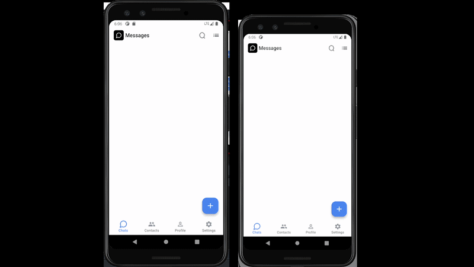
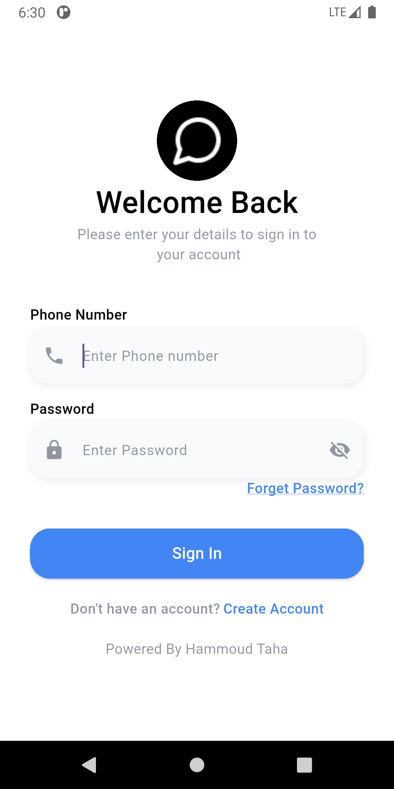
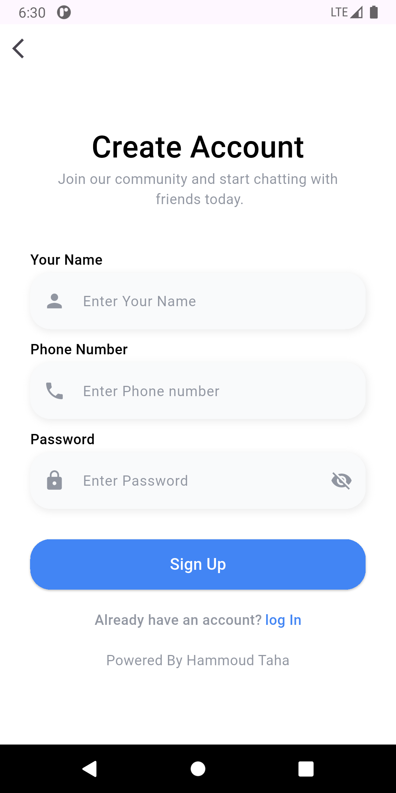
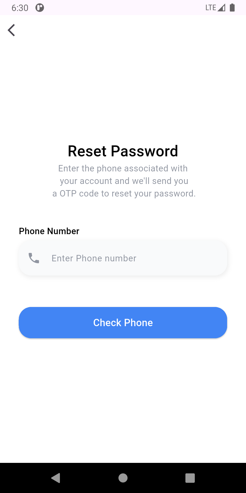
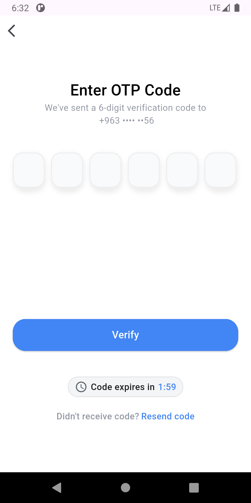
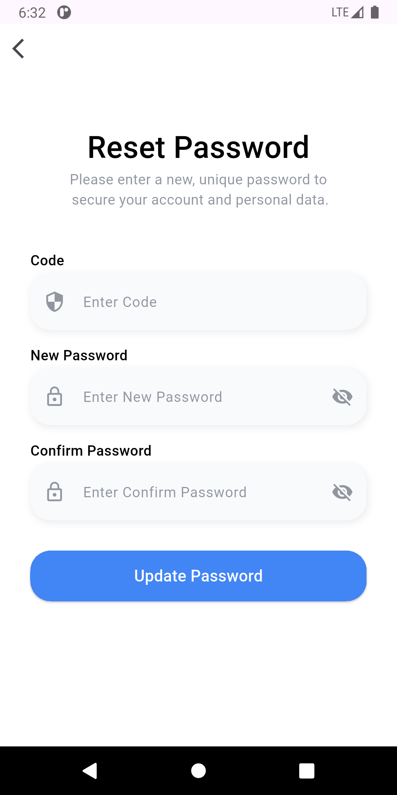
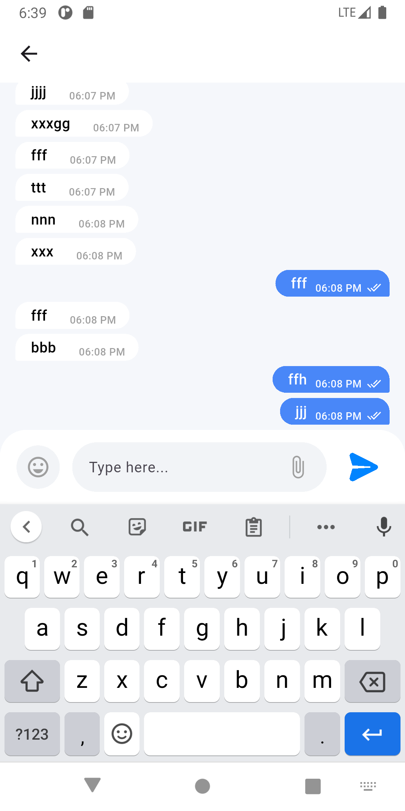
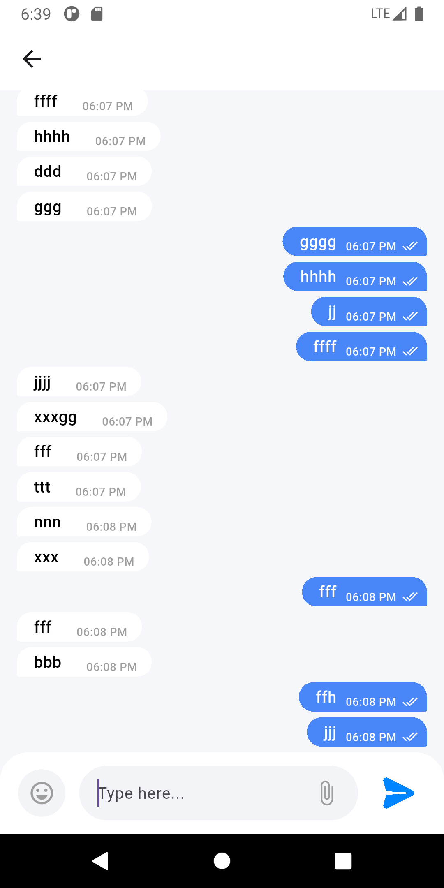
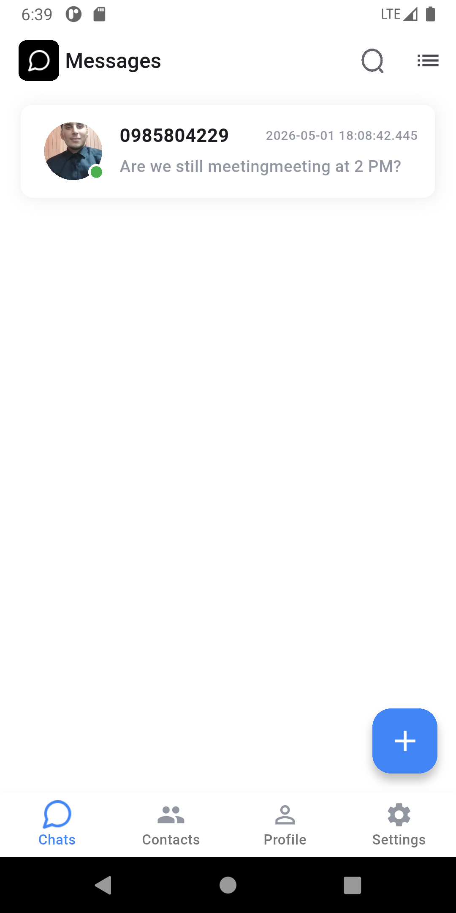
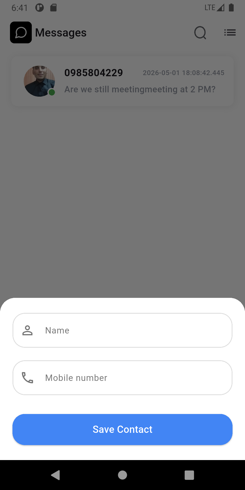

# 💬 ChatAPP

A modern real-time chat application built with **Flutter**, focused on simplicity, performance, and clean UI.

---

## 🚀 Overview

ChatAPP is a cross-platform mobile application that allows users to exchange messages in real-time.
The project demonstrates core chat functionalities and is designed as a solid foundation for scalable messaging systems.

---

## ✨ Features

- 💬 Real-time messaging
- 📱 Clean and responsive UI
- ⚡ Fast performance with Flutter
- 🔄 Instant message updates
- 🧩 Modular and scalable structure

---

## 📱 Demo

> 🎥 Real-time chat between two emulators



---

## 🖼Some Screenshots

| Onboarding                         | Login                         |
| ---------------------------------- | ----------------------------- |
|  |  |

| Register                         | Forget Password                |
| -------------------------------- | ------------------------------ |
|  |  |

| OTP                         | Reset Password                |
| --------------------------- | ----------------------------- |
|  |  |

| messages                         | messages                         |
| -------------------------------- | -------------------------------- |
|  |  |

| chat                         | messages                      |
| ---------------------------- | ----------------------------- |
|  |  |

---

## 🛠 Tech Stack

- **Tools:** Flutter + Firebase
- **Language:** Dart
- **Architecture:** (Clean Architecture)

---

## ⚙️ Getting Started

### 📋 Requirements

- Flutter SDK (3.x or higher)
- Dart SDK
- Android Studio / VS Code
- Emulator or physical device

---

### 🔧 Installation

```bash
git clone https://github.com/HammoudTaha/ChatAPP.git
cd ChatAPP
flutter pub get
flutter run
```

---

## 📁 Project Structure

```bash
lib/
 ├── core/
 │      ├──api
 │      ├──cache
 │      ├──config
 │      ├──connection
 │      ├──constants
 │      ├──routes
 │      ├──services
 │      ├──theme
 │      ├──utlis
 │      └──widgets
 ├── features/
 │      ├──auth
 │       │     ├──data
 │       │     ├──domain
 │       │     └──presentation
 │       ├──chat
 │       │     ├──data
 │       │     ├──domain
 │       │     └──presentation
 │       ├──home
 │       │     ├──data
 │       │     ├──domain
 │       │     └──presentation
 │       └── app.dart
 │
 │
 └── main.dart  # App entry point
```

---

## 🧠 Architecture Notes

The project follows clean structure:

- Separation between UI and reusable components
- Easily extendable to:
  - Provider / Bloc (state management)
  - Clean Architecture

---

## 📌 Future Improvements

- 🔔 Push notifications
- 👥 Group chat support
- 📎 Media sharing (images, files)

---

## 🤝 Contributing

Contributions are welcome!
If you'd like to improve this project, feel free to fork the repository and submit a pull request.

---

## 📄 License

This project is open-source and available under the MIT License.

---

## 👨‍💻 Author

Developed by **Hammoud Taha**

GitHub: https://github.com/HammoudTaha

---

## ⭐ Support

If you like this project, consider giving it a star ⭐
It helps others discover it!
